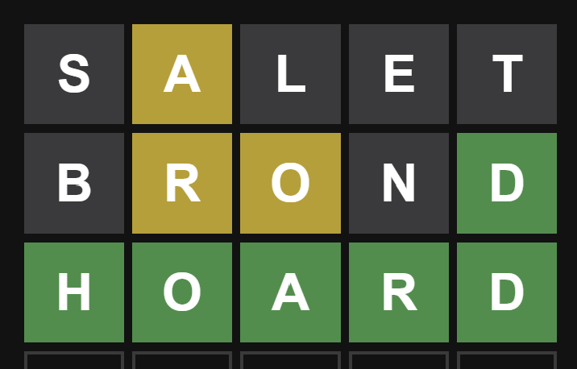
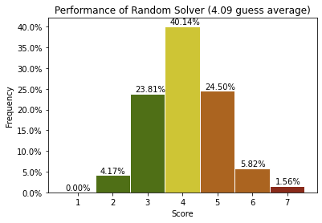
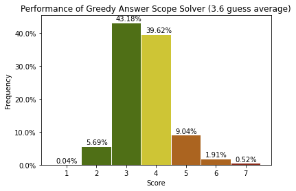
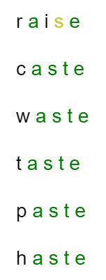
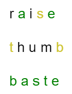
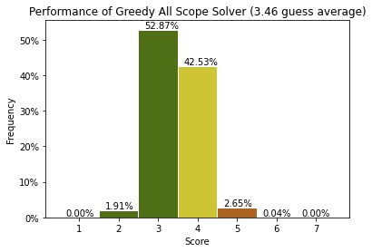
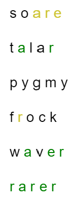
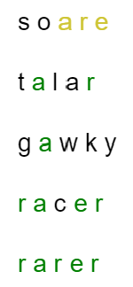
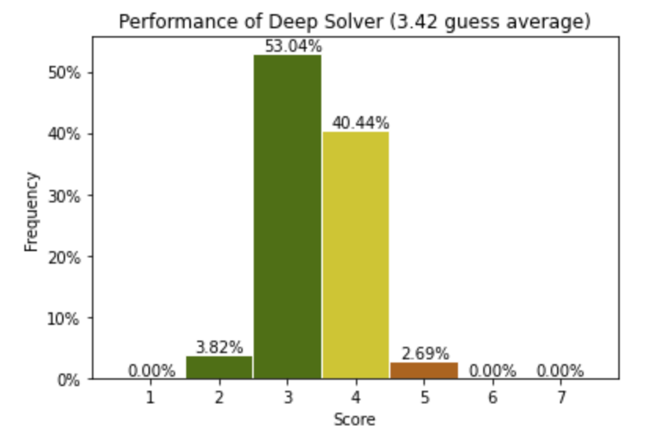
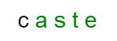

# Wordle Solver 📋

You've probably heard of wordle by now. But if you haven't it's like mastermind but with words. You're trying to guess a secret 5 letter word. And as you make your guesses you will know if each letter in your guess either exist in the secret word but are not in the correct position, or exist in the word and are at the correct position or they do not exist in the word at all. You then have 6 guesses to figure out the secret word.

  

But is there an optimal strategy to most effectively solve a wordle puzzle? What are easy to follow tips to be closer to this optimal strategy? AND WHAT IS THE BEST OPENER??

We will try to answer all these questions by comparing different solving strategies and incrementally improving them.

## Random Solver

The random solver is a solver that will simply play a random guess that could still be the answer. As we get more information on the hidden word based on the patterns, the number of words that could possibly be the answer is reduced. The solver will play randomly amongst this set. We will use this as a baseline to make sure that the strategies we come up with are able to at least perform better than playing randomly. This is probably somewhat close to how many (beginner?) humans play the game as they play the first word that comes to mind that does not violate the previously obtained pattern. (Not using grayed out letters, using all yellow and green letters previously obtained)

  

The average score obtained is just over 4 guesses. This is suprisingly pretty good for guessing randomly which really highlights that the patterns we obtain from each guess can give us lots of information about what words are not the answer. However, this staregy does lead to around 1.5% of puzzles not getting solved in the maximum of 6 guesses to win the game.

This shows that the common human strategy of just inputing the first word that comes to mind that does not violate the previously obtained patters performs not so bad at an average of 4 guesses. But there is still room for improvement as this stategy leads to some puzzles going unsolved.

## Greedy Answer Scope Solver

This next stategy is the first to make use of information theory. In short, we want our guess to on average most decrease the number of possible words that could still be the answer after the pattern is revealed. For example, if we take our very first guess with the word "crate" and the pattern is all gray, we can eliminate any word that contain any of these letters to possibly be the answer. And we repeat this for every single pattern to get an average of what guess will eliminate the most number of words. With this strategy, the optimal operner is "raise" which on average reduces the number of opssible answers from 2302 does to 40.14 words.

The Greedy Answer Score Solver will guess using the guess guess that eliminates the most number of words but again only guessing with words that can still potentially be the answer. So this would be close to the optimal strategy when only picking words that don't violate the previously revealed patterns. (Never using grayed out letters for future guesses, always using all yellow and green letters)

  

Making use of information theory greatly helped with the performance. The average number of guesses decreased to 3.6! But we can still see a few games where the hidden word was never found. So what is going on? Let's look at one of the failures to understands the drawbacks of the strategy.

For example the solver failed when the hidden word was **"baste"** here is how the game went.

  

The first guess "raise" gets 2 greens and a yellow. Great start. This actually decreased the number of possible answers from 2302 down to 9 possible words fitting that pattern. ("baste", "caste", "haste", "paste", "salve", "sauce", "saute", "taste", "waste")

The best guess to go forward was "caste" which on average would narrow it down to 2.43 answers. We got 5 greens! This sounds good, but in this case, we were not so lucky and it only narrowed it down to 5 answers. Getting grays springily would have been more useful! The 5 possible guesses left are "baste", "haste", "paste", "taste", "waste". At this point any guess is as good as any and sadly in this case, we got unlucky and lost. If you play wordle frequently, this very frustrating situation has probably happened to you. But is there a better strategy? (Spoiler alert, there is...)

So far, we have only limited the words we guess to words that could potentially be the answer by never violating the previously revealed patterns. Guessing something that could not be the answer sound counter intuitive, but let's see if it cold have helped us in this case.

On the second guess, instead of guessing "caste" which contains an "s" and has an "a" and "e" at the second and fifth position respectively, what if we guessed something that does not respect this pattern but still on average narrows down the answers the most. The best word that comes out is "thumb". On average guessing this word would decrease the number of possible answers from 9 down to 1.44 (much better than the 2.43 answers that "caste" offered) which means that more often than not, the resulting pattern will give us enough information to narrow it down to 1 answer. In this case, the game goes like this.

  

On the second guess, guessing "thumb" confirmed that our word has a "t" and an "b" which only one of the 9 possible words ("baste", "caste", "haste", "paste", "salve", "sauce", "saute", "taste", "waste") had, narrowing down the possible answers only to "baste" solving the wordle. And if we would have gotten a different pattern, it would have narrowed things down to a different word. Or if we are unlucky, it would have narrowed it down to two words.

This is interesting as it demonstrates that you can obtain more information by guessing something that does not follow the patterns that were previously revealed by your old guesses. Let's see how much using this strategy batters the overall performance.

## Greedy All Guesses Scope Solver

The greedy All Guesses Scope Solver is similar to the previous solver. It also uses information theory to determine which guess will on average narrow down the number of possible answers most. But this time, it can also guess words that do not follow the patterns revealed by old guesses.

This time, the opener is slightly different as we also consider words that are not part of the answer set. The word that on average narrows down the answer the most ended up being "soare". This guess will on average narrow down the answer from 2301 words down to 38.8 words. (Slightly better than 40.14 we were previously getting with "crate")

  

Allowing our solver to make guesses that do not respect the previously revealed patterns from old guesses leads to a much better performance of 3.4 guesses on average! It is finally able to consistently solve every wordle. Unsurprisingly, the number of games where the hidden word is guessed in 2 guesses has decreased since we are now guessing words that could not possibly be the answer based on previously revealed patterns. But this cost is worth it since the overall performance is what we are trying to optimize for.

But can we do better? We are computing which guess on average will narrow down the list of possible answers the most. But what if that list of narrowed down words is harder to further narrow down on the next guess compared to a list of narrowed down words that is slightly larger but better distributed to further narrow down on the next guess? Let's see some of the worse performances to better understand this.

For example, when the hidden word was "rarer", this is how the game played out.

  

On the first guess, our opener "soare" gets 3 yellows then the second guess "talar" gets 2 greens which narrows down the answer from 2301 words down to 15 words. ("baker", "caper", "eager", "gamer", "gayer", "gazer", "maker", "paper", "parer", "payer", "racer", "rarer", "wafer", "wager", "waver")

On the third guess we use the word "pygmy" which would on average most narrow down the answers from 15 down to 2.05 words. This means that most of the time, guessing "pygmy" would narrow it down to 2 answers. But in this case, we get unlucky and get all grays which only narrows it down to 5 answers. ("baker", "racer", "rarer", "wafer", "waver")

Next, we guess with the word "frock" which on average should narrow it down from 5 words to 1.32 but again, we get unlucky and in this case, we end up with 2 words. And end up guessing correctly on the 6th attempt.

This is a case where when making the third guess "pygmy", even if making this guess on average narrows down the answer most, there are some "worst case scenarios" which lead to a much worse score by winning on the 5th or 6th guess. So this highlights the concept that there is no point guessing a word that on average narrows down the answer most if the narrowed down list is difficult to effectively further narrow down.

On average by playing optimally, when guessing "pygmy" on the third guess, we would be able to beat the wordle in 2.53 guesses (total of 4.53 including the first two guesses). So in our case, solving in 6 guesses is quite unlucky. But a better guess for example would have been "gawky". This guess on average only narrows down the answers from 15 down to 2.26 (worse than the 2.05 from "pygmy") but on average solves the wordle in 2.47 guesses (better than 2.53 from "pygmy").

Here is how the rest of the game would have gone:

  

So we end up doing slightly better on this particularly hard to solve word. But this is only one example, what happens when we always take the path that optimizes the average wordle solve score rather than just looking to on average narrow down the possible answers for the next guess?

## Greedy Deep Solver

The greedy solver is the best of all solvers. It looks at each guess, and looks at all the possible patterns that could be revealed by that guess, then looks at what would be the next best guess for each potentially resulting pattern and so on. It essentially computes how many guesses on average would be needed to complete the wordle if this guess is made. It essentially tries to play all possible wordle games in advance and tell you what guess will lead to the best score.

But computing all possible wordle games is computationally very expensive. So we make use of a heuristic to determine what branches are the most interesting to explore. The heuristic used is how much does the guess on average narrow down the number of possible answers.

For example, there is no point considering the word "fuzzy" as an opener guess when on average it narrows down the possible answers from 2301 down to 620 guesses when the top 10 words are all able to on average narrow it down to 40.45 words. We discussed earlier how this metric doesn't tell the whole story, but it still a great indicator of how good a guess potentially is.

By exploring only guesses that are able to on average most effectively narrow down the possible answers, we determined that "salet" is the most optimal wordle opener.

  

We can see that the overall performance is ever so slightly better averaging with a score of 3.42 guesses. We can see a slight decrease in scores of 4 and an increase in scores of 2. This is essentially the theoretical limit of wordle **\*\***.

Does this ruin the game? Not at all! If you play wordle, you don't have to use these algorithms to tell you what your next best guess is. But you can apply the learnings we made through incremental improvements to adapt your wordle playstyle to become a better player and share your \#wordle scores!

**\*\*** It is only probably the theoretical limit of wordle because computing the whole game tree is too expensive and we are assuming that the best theoretical guess is amongst the guesses that have the highest information content.

# So what did we learn?

## The second guess is very important!

On your second guess, try not to reuse any of the letters from the first guess. Especially if the letter was highlighted green! If your second guess includes that same letter in the same position, surprise surprise... it's green again... which you already knew. So you are not getting any additional information from that. It could be beneficial for your second letter to include some of the letters that were highlighted yellow as you could try to get a green from it, but don't feel like you have to!

For example when the opener yields the pattern:

  

Here, you might be tempted to guess something that does not violate the pattern using all the greens. The best guess of sorts would be "range" which on average if continuing with that strategy would solve the wordle in 3.5 guesses. But in fact, the top 10 best second guess from this pattern is:

- cumin (On average will solve in 2.2778 more guesses)
- crumb (On average will solve in 2.2778 more guesses)
- brung (On average will solve in 2.3333 more guesses)
- grind (On average will solve in 2.3333 more guesses)
- grund (On average will solve in 2.3333 more guesses)
- curvy (On average will solve in 2.3333 more guesses)
- mucin (On average will solve in 2.3333 more guesses)
- rungs (On average will solve in 2.3333 more guesses)
- mungo (On average will solve in 2.3333 more guesses)
- munch (On average will solve in 2.3333 more guesses)

As you can see, none of them contain the letters "a" or "e". And the average solve score is much better than the best guess that follows the pattern. ("range" with an average of 3.5 more guesses to solve)

If you are not sure what guesses are good to follow up your opener with, here are some pairings which might work decently will in general. (These are not optimal but probably usually not a bad second guess)

opener - (second guess options)

- salet - (prion/corny)
- trace - (noils/loins)
- crate - (loins/noils)
- reast - (colin/nicol)
- slate - (corni/prick)
- carle - (point/suint)
- carte - (loins/noils)
- caret - (sloid/linos)
- stare - (nicol/colin)
- snare - (doilt/clipt)

## Don't fall for the 4 Greens Trap

The 4 Greens Trap is when you get a pattern with 4 greens and a gray and you can think of **more than 3** different words that could fit that pattern. (Keep in mind that there could be more words that you can't think of as well.) In general if you apply the first learning and never use your green letters on the second guess, this should already happen to you less.

I know that it might be tempting to "just go for it" as you might be able to get the answer on the next attempt, but let's think about your expected number of guesses that are required to solve the wordle from this point.

For four different possibilities:

Expected score = 1 * 0.25 + 2 * 0.25 + 3 * 0.25 + 4 * 0.25 = 2.5

For five different possibilities:

Expected score = 1 * 0.2 + 2 * 0.2 + 3 * 0.2 + 4 * 0.2 + 5 * 0.2 = 3

And so on...
E(number of words that fit the 4 greens pattern) = 2 + 0.5(number of words that fit the 4 greens pattern - 3)

So the more words you can think of fit the 4 greens pattern, the less likely you are to solve the wordle on the maximum of 6 guesses. (I guess that's obvious) Again, this only applies to when you can think of more than 3 words that fit the 4 greens pattern.

For example, when we get the pattern:

  

There are still 5 possible words that can fit this 4 greens pattern. "baste", "haste", "paste", "taste", "waste". In this case, on average you will be getting the correct answer on your 3rd guess. And remember that this is an expected score, if you are running out of guesses you might not even be able to find which one is the hidden word.

In a case like this, guessing the word "twerp", "tophs", or "tweep" are much better guesses. Of course, that isn't going to be the answer, but these guesses will all result in an average of 2.2 guesses to solve the wordle with a worst case scenario of 3 guesses. (better than the average of 3 and worst case of 5 we saw before) So most of the time you will be able to solve it in 2 more guesses and if you are unlucky, in 3 guesses. We can see that these words all try to include as many of the missing letter from all the possible answers. This really is the same concept as the first takeaway, but here it can be done in a much more manageable level where you really try pinpoint the perfect guess to minimize your average score.

## The best opener

The best opener in theory is "salet" which if playing optimally will be able to solve the wordle puzzle in 3.42 guesses. But again, this is only if you play perfectly optimally which as a human you will not be able to do. In short, you shouldn't just use "salet" because it is "the best opener". You should use an opener that you like, and that contains letters that you are confident playing off of for your second guess. If you find that when one of the letters of your opener lights up green or yellow and you often find yourself struggling to find a good second guess, consider using a different opener that does not contain those letters.

Here is a list of the top 10 best openers. Chose one that you like, and if it isn't working out for you, use one that differs slightly! The performance difference is so small that any of them will feel virtually the same, it's all about how well you're able to play your second guess of the first revealed pattern!

- salet on average will lead to a solve in 3.4201 guesses
- trace on average will lead to a solve in 3.4209 guesses
- crate on average will lead to a solve in 3.4218 guesses
- reast on average will lead to a solve in 3.4222 guesses
- slate on average will lead to a solve in 3.4222 guesses
- carle on average will lead to a solve in 3.4266 guesses
- carte on average will lead to a solve in 3.4318 guesses
- caret on average will lead to a solve in 3.4405 guesses
- stare on average will lead to a solve in 3.4418 guesses
- snare on average will lead to a solve in 3.4444 guesses
